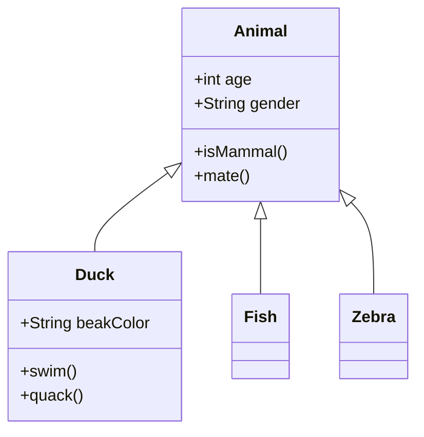
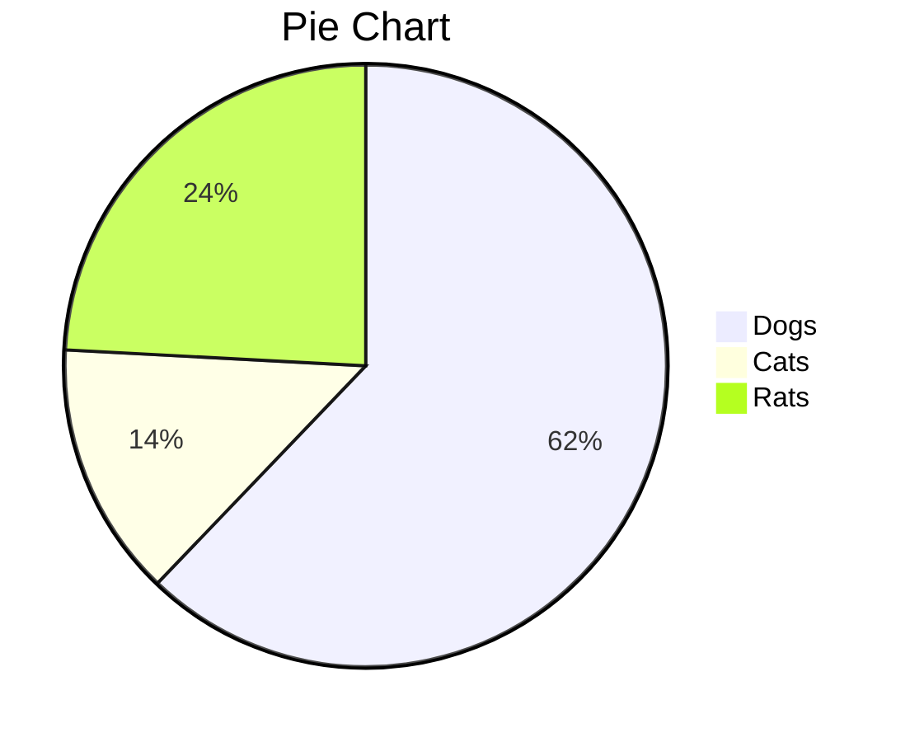
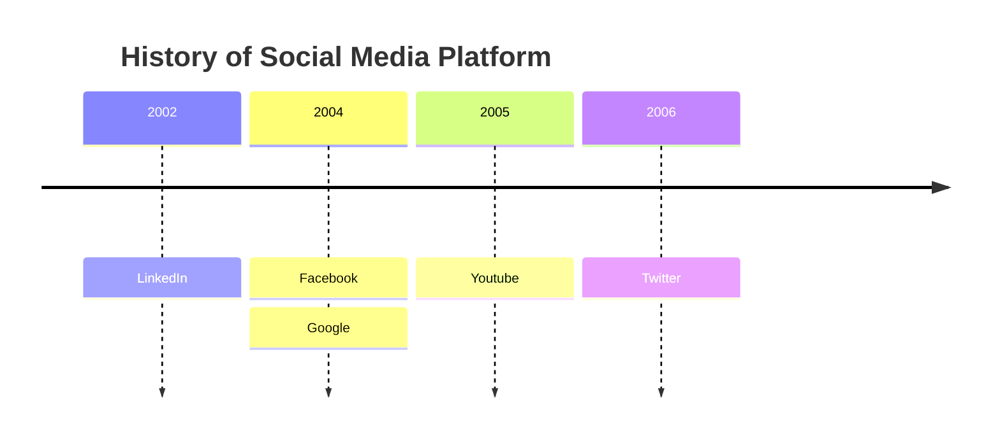
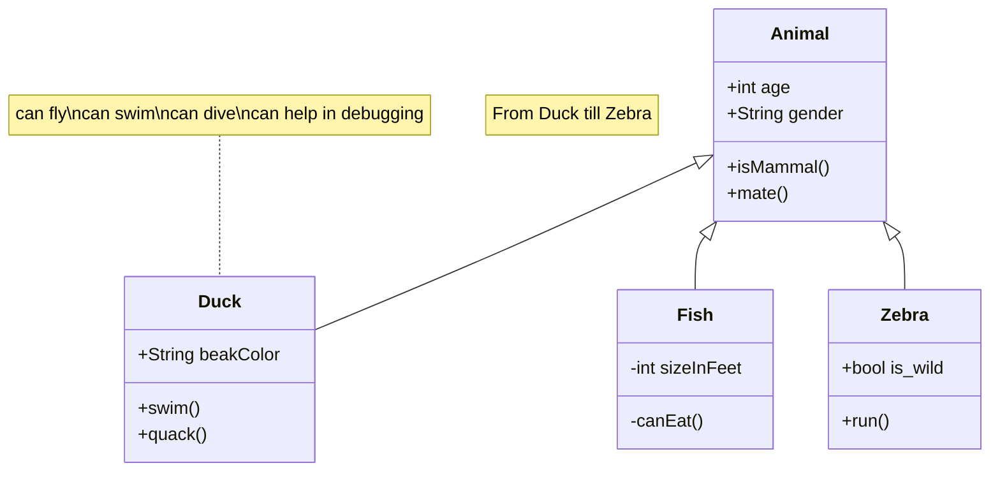
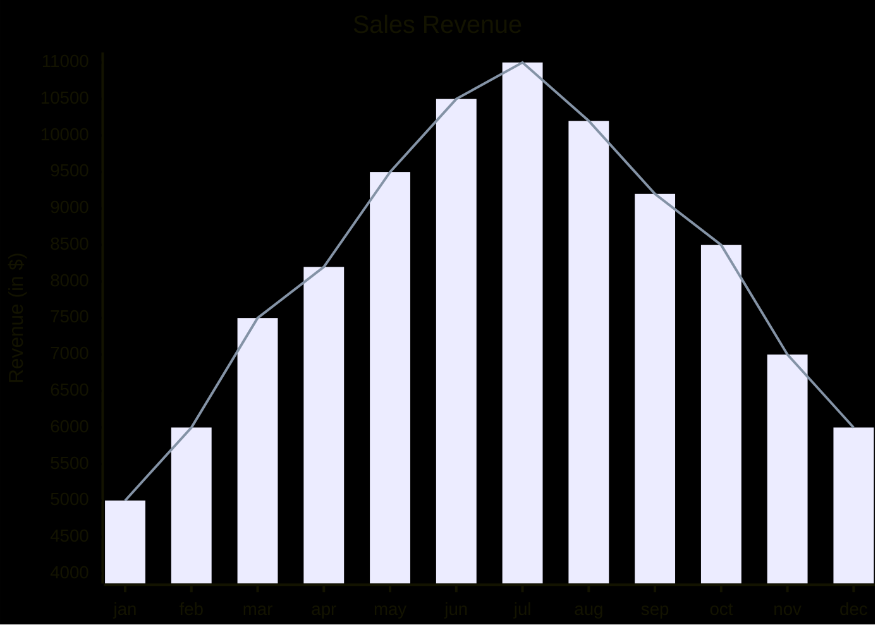

#diagramas #ejemplos #obsidian
Ejemplos para construir diferentes diagramas:
[Documentación externa](https://support.typora.io/Draw-Diagrams-With-Markdown/)
  para formato #SQL:
``` sql
SELECT * FROM ESQUEMA.TABLA;
```




## Pie Charts




### An example of a timeline[​](https://mermaid.js.org/syntax/timeline.html#an-example-of-a-timeline)

##### Code:



title: Animal example
---






```mermaid
%%{init: {"themeVariables": {"fontSize": "14px", "fontFamily": "Arial", "textColor": "#ff0000"}}}%%
xychart
  x: "Category"
  y: "Value"
  series:
    - x: "A"
      y: 10
    - x: "B"
      y: 20
    - x: "C"
      y: 15
```
